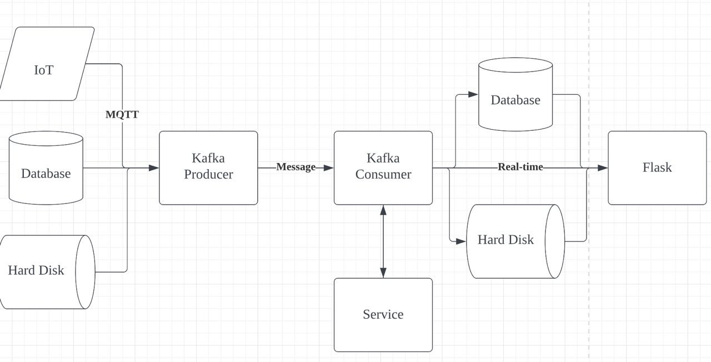
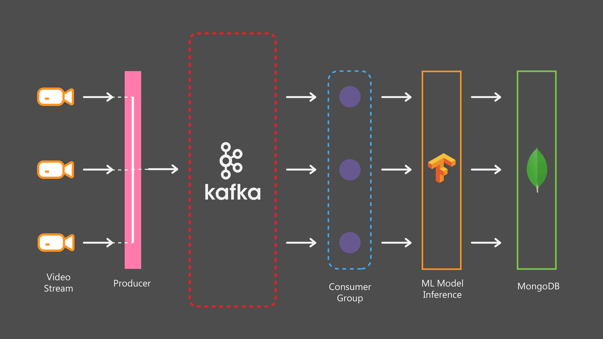

## Start Kafka and MongoDB
```bash
pip install confluent-kafka
pip install pymongo

sudo docker-compose -f zk-single-kafka-single.yml up -d

docker volume create kafka-mongodb
docker run -v kafka-mongodb:/data/db -p 27017:27017 --name mongodb -d mongo
```

If you failed to create docker containers, and `docker conatiner logs id` shows that `Unable to create data directory /var/lib/zookeeper/log/version-2`. This may be caused by full disk (`docker system df`), run`docker builder prune` to clear build cache.

### Create Topic

```bash
python create_topic.py
```

### Produce 

```bash
python producer_app.py --topic object_detection_test04_min_test_006_topic --directory ../kafka/dataset/proj_dataset/min_test/006/image
python producer_app.py --topic object_detection_test04_min_test_tv_city_topic --directory ../kafka/dataset/proj_dataset/min_test/tv_city/image
python producer_app.py --topic object_detection_test04_min_test_follow_vehicle_topic --directory ../kafka/dataset/proj_dataset/min_test/follow_vehicle/image
python producer_app.py --topic image_classification_test01_flight_data_topic --directory ../kafka/dataset/flight_data
python producer_app.py --topic image_classification_test01_flight_data1_topic --directory ../kafka/dataset/flight_data
python producer_app.py --topic image_classification_test01_flight_data2_topic --directory ../kafka/dataset/flight_data
```

```bash
root - INFO - msg produced. 
Topic: object_detection_test04_topic 
Partition: 0 
Offset: 63 
Timestamp: (1, 65) 

root - INFO - msg produced. 
Topic: object_detection_test04_topic 
Partition: 0 
Offset: 64 
Timestamp: (1, 66) 

Wrote 67 messages into topic: object_detection_test04_topic 
```

### Consume

```bash
python consumer_app.py --topic object_detection_test04_min_test_006_topic
python consumer_app.py --topic object_detection_test04_min_test_tv_city_topic
python consumer_app.py --topic object_detection_test04_min_test_follow_vehicle_topic
python consumer_app.py --topic image_classification_test01_flight_data_topic
python consumer_app.py --topic image_classification_test01_flight_data1_topic
python consumer_app.py --topic image_classification_test01_flight_data2_topic
```

```bash
Waiting...
Consumed event from topic my_image_topic: key = 0           
Consumed event from topic my_image_topic: key = 1           
Consumed event from topic my_image_topic: key = 2 
Waiting...
```

## Start Flask

```bash
pip install flask

python app.py
```

```bash
curl -H "Content-type: application/json" -X POST 127.0.0.1:8000/get_img -o result.json
```

### API Endpoint for image classification

The API endpoint is located at `http://localhost/get_classified_img`.
Request Format

The API accepts POST requests in JSON format with the following fields:

- `plane_id: will not be used.`

Example Request:

```json
{
    "plane_id": "1"
}
```

Response Format

The API returns a JSON object with the following fields:
- `success: Boolean value indicating if the request was successful.`
- `class_name: Class name of the classified image.`
- `service: Name of the service.`
- `base64_str: Base64 string of the classified image.`
- `score: The score of the classification.`
- `message: A message describing the result of the request.`

Example Response:

```json
{
    "success": true,
    "class_name": "Cat",
    "service": "Image Classification",
    "base64_str": "iVBORw0KGgoAAAANSUhEUgAAABAAAAAQCAYAAAAf8/9hAAABmklEQV",
    "score": 0.99,
    "message": "Object successfully classified."
}
```

Error Responses

The API returns an error response if the request is malformed or if an error occurs during processing. The error response will contain a message describing the error.

Example Error Response:

```json
{
    "success": false,
    "message": "Malformed request data. Please provide a valid plane ID."
}
```

### API Endpoint for object detection

The API endpoint is located at http://localhost/get_img.
Request Format

The API accepts POST requests in JSON format with the following fields:

- `plane_id: A unique identifier for the rendering job with plane id.`

Example Request:

```json
{
    "plane_id": "1"
}
```

Response Format

The API returns a JSON object with the following fields:
- `success: Boolean value indicating if the request was successful.`
- `service: Name of the service.`
- `base64_str: Base64 string of the image with detected objects.`
- `class_name: A list of class names of the detected objects.`
- `location: A list of coordinates representing the location of the object in the image.`
- `message: A message describing the result of the request.`

Example Response:

```json
{
    "success": true,
    "service": "Object Detection",
    "base64_str": "iVBORw0KGgoAAAANSUhEUgAAABAAAAAQCAYAAAAf8/9hAAABmklEQV",
    "class_name": ["person", "person", "car", "car"],
    "score": [1.0, 1.0, 1.0, 1.0],
    "position": [{"left": 315.0, "top": 268.0, "height": 324.0, "width": 336.0}, {"left": 270.0, "top": 254.0, "height": 321.0, "width": 291.0}, {"left": 647.0, "top": 247.0, "height": 279.0, "width": 679.0}, {"left": 437.0, "top": 282.0, "height": 311.0, "width": 472.0}, {"left": 250.0, "top": 254.0, "height": 320.0, "width": 272.0}],
    "message": "Object successfully classified."
}
```

Error Responses

The API returns an error response if the request is malformed or if an error occurs during processing. The error response will contain a message describing the error.

Example Error Response:

```json
{
    "success": false,
    "message": "Malformed request data. Please provide a valid plane ID."
}
```


## New API

### Example:
Request:
```bash
127.0.0.1 - - [18/Apr/2023 21:37:43] "GET /get_document?collection=object_detection_test04_min_test_follow_vehicle_topic HTTP/1.1" 200 -
```

Response:
```json
{
    '_id': ObjectId('643e9b5b25126cc2ba3b6cd6'), 
    'base64_str': 'iVBORw0KGgoAAAANSUhE',
    'result_list': [{'class_name': 'car', 'score': 0.50668, 'position': {'left': 1071.8, 'top': 920.4, 'width': 23.5, 'height': 14.4}}, {'class_name': 'car', 'score': 0.40999, 'position': {'left': 1008.4, 'top': 829.9, 'width': 22.2, 'height': 18.8}}, {'class_name': 'car', 'score': 0.31931, 'position': {'left': 1016.8, 'top': 840.0, 'width': 23.9, 'height': 12.3}}]
}
```

### Example

Request:
```bash
127.0.0.1 - - [18/Apr/2023 21:31:02] "GET /get_document?collection=image_classification_test01_flight_data_topic HTTP/1.1" 200 -
```

Response:
```json
{
    '_id': ObjectId('643e9b5b25126cc2ba3b6cd6'), 
    'base64_str': 'iVBORw0KGgoAAAANSUhE',
    'result_list': [{'score': 0.14851722121238708, 'classfication': '美洲虎'}]
}
```